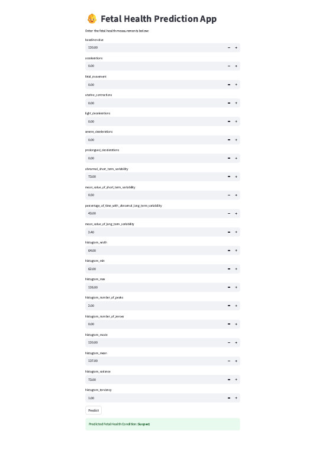

# 🧠 Fetal Health Classification using Machine Learning

## 📌 Overview

This project builds an intelligent system for classifying fetal health status using cardiotocographic (CTG) data. It predicts whether a fetus is in a **Normal**, **Suspect**, or **Pathological** state. The goal is to aid clinicians in making early and accurate decisions through data-driven insights.


## 🚀 Features

- 📊 **Exploratory Data Analysis (EDA)** with visual insights  
- 🧹 **Data Preprocessing** including feature scaling and handling class imbalance  
- 🤖 **Model Building**: Tested multiple ML classifiers — Random Forest, XGBoost, SVM, etc.  
- 📈 **Evaluation Metrics**: Accuracy, Precision, Recall, F1-score, ROC-AUC  
- 🌐 **Deployment**: Real-time prediction app using Streamlit  

## 🗂️ Dataset

The dataset used is based on CTG recordings, containing attributes such as:  
- Baseline fetal heart rate  
- Accelerations and decelerations  
- Uterine contractions  
- Short- and long-term variability  

📌 https://www.kaggle.com/datasets/andrewmvd/fetal-health-classification


## ⚙️ Installation

Clone the repository:  
```
git clone https://github.com/auspicie/Fetal_Health_Classification-ML.git  
cd Fetal_Health_Classification-ML  
```  
## 🚀 Features

- Exploratory Data Analysis

- Data Preprocessing: Feature scaling, Handling class imbalance

- Model Selection: Evaluation of multiple ML classifiers (e.g., Random Forest, XGBoost, SVM)

- Performance Metrics: Accuracy, Precision, Recall, F1-score, ROC-AUC

- Deployment: Interactive web app using Streamlit

Install dependencies:  
```
pip install -r requirements.txt  
```  

## 💻 Usage

Run the Streamlit app locally:  
```
streamlit run Fetal_health_classification_app.py  
```  

The app provides a simple interface to input CTG values and predict fetal health status instantly.

**Install dependencies**

## 📎 Project Structure

```
Fetal_Health_Classification-ML/
│
├── data/                       # Dataset files
├── notebooks/                  # EDA & Model training
├── app/                        # Streamlit app files
├── models/                     # Saved model and features
├── requirements.txt
└── Fetal_health_classification_app.py
```

## 📷 App Preview




## 📌 License

This project is licensed under the [MIT License](LICENSE).

# 💻 Usage

**Run the Streamlit app:**

streamlit Fetal_health_classification_app.py

## 🤝 Contributing

Contributions are welcome! If you’d like to improve this project or add new features:  
```
fork → clone → make changes → submit a pull request  
```

## 🙋‍♂️ Author

**Samsudeen A.**  
📧 auspicie@github  
🔗 https://www.linkedin.com/in/samsudeen-bankole-b7b78554/


⭐ If you found this project useful, don’t forget to star the repo and share it!
